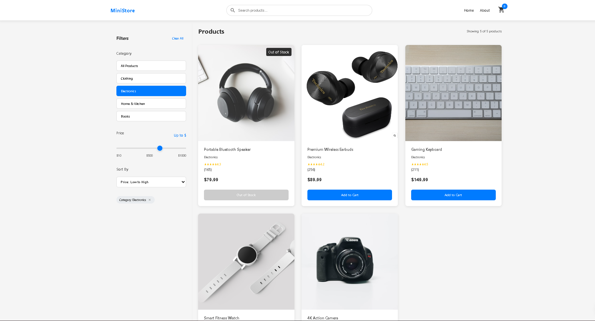

# MINI-STORE

MINI-STORE is a responsive React e-commerce catalog built as a portfolio project. It provides a realistic browsing experience with mock product data and simulated service behavior; it does not process payments or store customer data.



## Status

This is a frontend-only demonstration. Product data is bundled with the application, and the product service is deliberately shaped so it can later be replaced with a REST, Supabase, Firebase, or headless-commerce implementation.

## Features

- Browse a responsive product catalog.
- Search products with debounced input.
- Filter by category and maximum price.
- Sort by price, rating, name, and review count.
- View product details, stock availability, and related products.
- See loading, empty, and retryable error states.
- Cancel stale product requests when catalog filters or routes change.
- Run catalog filtering and sorting tests in Vitest.

## Technology

- React 19
- React Router 7
- Rolldown Vite 7
- JavaScript and JSX
- CSS Modules
- Context API for catalog filters
- Vitest for unit tests
- ESLint and Prettier for code quality

## Architecture

```text
src/
  components/           Reusable presentational components
  context/              Filter provider and context definition
  data/                 Bundled mock product data
  features/products/    Catalog rules, tests, and product service
  hooks/                Reusable React hooks
  pages/                Route-level catalog, detail, and 404 screens
```

Pages use `productService` rather than importing the mock data directly. Catalog filtering and sorting are pure functions in `src/features/products/catalog.js`, which makes the current mock implementation replaceable without changing the UI.

## Getting started

### Prerequisites

- Node.js 22 or later
- npm 10 or later

### Install and run

```bash
git clone https://github.com/luigi043/MINI-STORE.git
cd MINI-STORE
npm install
npm run dev
```

Open the URL printed by Vite (normally `http://localhost:3000`).

## Environment variables

Copy `.env.example` to `.env.local` to configure local development. Do not commit `.env` files.

| Variable                     | Purpose                                                                             | Default |
| ---------------------------- | ----------------------------------------------------------------------------------- | ------- |
| `VITE_ENABLE_MOCK_API_ERROR` | Simulates a product-service failure in development so the retry UI can be verified. | `false` |

## Scripts

| Command                 | Description                                   |
| ----------------------- | --------------------------------------------- |
| `npm run dev`           | Start the Vite development server.            |
| `npm run build`         | Create a production build in `dist/`.         |
| `npm run preview`       | Serve the production build locally.           |
| `npm run lint`          | Lint application source files.                |
| `npm run test:run`      | Run the Vitest suite once.                    |
| `npm run test:coverage` | Run tests with V8 coverage.                   |
| `npm run check`         | Run linting, tests, and the production build. |
| `npm run format`        | Format source files with Prettier.            |

## Quality and accessibility

The project includes visible keyboard focus styling, semantic route content, labeled search and filter controls, and loading/empty/error feedback. The CI workflow runs `npm ci` and `npm run check` for pushes and pull requests to `main`.

No formal Lighthouse or assistive-technology audit has been completed yet. Accessibility work still needed includes dialog focus management for future cart/checkout UI, comprehensive heading review, and verification against WCAG 2.2 AA.

## Deployment

The app can be deployed to Vercel or Netlify as a static Vite site:

1. Import this repository in the provider dashboard.
2. Use `npm run build` as the build command.
3. Publish the `dist` directory.
4. Add any `VITE_*` variables in the provider's environment settings.

There is no live demo configured in this repository at present.

## Current limitations

- Product data and availability are mock data.
- Cart and wishlist controls are not implemented yet.
- Checkout, authentication, account, and admin features are not implemented.
- No backend, payment processing, or real customer data exists.
- Product images are third-party remote URLs and should be moved to a managed image service before a production launch.

## Roadmap

1. Add persistent cart and wishlist state with stock validation.
2. Add a clearly labeled demonstration checkout and account screens.
3. Add route-level loading/error boundaries and accessibility verification.
4. Add an admin demonstration area using mock repositories.
5. Introduce a real API, authentication, authorization, and payment provider only when the project scope requires them.

## License and author

No license has been selected yet. Contact [Luiz Morais](https://github.com/luigi043) for portfolio or collaboration enquiries.
